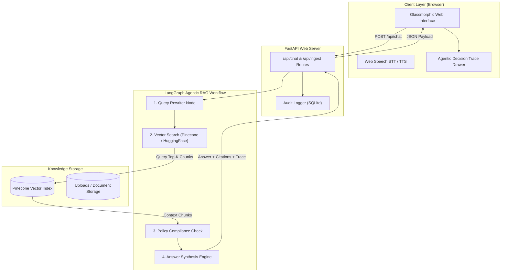

# Enterprise HR Policy Agentic RAG Copilot 🤖💼

[](https://www.python.org/)
[](https://fastapi.tiangolo.com/)
[](https://www.langchain.com/)
[](https://www.pinecone.io/)
[](https://www.docker.com/)
[](LICENSE)

An enterprise-grade, autonomous **Employee Support & HR Policy Copilot** powered by multi-step **Agentic Retrieval-Augmented Generation (RAG)**, **LangGraph workflows**, and a modern **interactive Glassmorphism Web Interface**. 

Designed for high accuracy, verifiable policy compliance, transparent execution traces, and real-time knowledge base document ingestion.

---

## 🌟 Key Features

- **🤖 Multi-Step Agentic RAG Engine**:
  - **Query Rewriter**: Transforms raw employee questions into optimized semantic search vectors.
  - **Pinecone Vector Search**: Retrieves top-$k$ relevant policy document chunks with similarity scoring.
  - **Compliance & Policy Verification**: Evaluates compliance guidelines, dates, and organizational scope.
  - **Response Synthesis with Citations**: Generates precise answers mapped directly to verified HR documents.

- **🎨 Modern Glassmorphic Interactive Web UI**:
  - **Dark / Light Theme Engine**: Seamless theme toggle with local storage persistence.
  - **Real-Time Decision Trace Drawer**: Live step-by-step pipeline visualizer showing real-time agent reasoning and JSON payloads.
  - **Instant HR Topic Shortcuts**: One-click quick query cards for Paid Time Off (PTO), Remote Work Stipend, Parental Leave, and Health Benefits.

- **🎙️ Voice & Audio Experience**:
  - **Speech-to-Text (STT)**: Hands-free query input using the Web Speech API with visual microphone pulse.
  - **Text-to-Speech (TTS)**: Read-aloud functionality for assistant responses.
  - **Web Audio FX Synthesizer**: Subtle, toggleable audio sound effects for key user interactions.

- **📁 Knowledge Base Ingestion**:
  - **Drag & Drop Upload**: Secure drag-and-drop dropzone supporting `.pdf`, `.txt`, `.md`, and `.docx`.
  - **Admin Verification**: Protected by `X-Admin-Key` header authentication.
  - **Automated Chunking & Indexing**: Real-time progress meter showing document tokenization and vector indexing.

- **🛡️ Enterprise Governance & Audit Logging**:
  - **SQLite Audit Trail**: Logs query inputs, response times, sources used, and compliance checks for compliance reporting.

---

## 🏗️ Architecture & Agentic Workflow



---

## 🛠️ Tech Stack

| Domain | Technology / Library | Description |
| :--- | :--- | :--- |
| **Framework** | **FastAPI** `0.116.1` | High-performance Python web framework |
| **Agentic Workflow** | **LangGraph** `1.1.10` & **LangChain** `0.4.2` | Orchestrates multi-step agent graphs & state management |
| **Vector DB** | **Pinecone** `7.3.0` | Cloud vector database for fast HNSW cosine search |
| **LLM Provider** | **OpenAI API / NVIDIA API** | `meta/llama-3.3-70b-instruct` / `gpt-4o` for LLM inference |
| **Embeddings** | **HuggingFace** (`intfloat/e5-small-v2`) | High-density text embeddings |
| **Frontend** | **HTML5, CSS3, Vanilla JS (ES6+)** | Zero-dependency responsive interface with custom theme engine |
| **Containerization** | **Docker & Docker Compose** | Multi-stage container builds & service orchestration |
| **Web Server** | **Uvicorn** `0.35.0` | ASGI server implementation |

---

## 📁 Directory Structure

```
Employee_Support_Agentic_Rag/
├── app/
│   ├── api/
│   │   └── routes.py         # FastAPI REST endpoints (/api/chat, /api/ingest, /api/health)
│   ├── core/
│   │   ├── config.py         # Pydantic Settings & environment variable configuration
│   │   └── logging.py        # Centralized structured logging setup
│   ├── rag/
│   │   ├── state.py          # LangGraph state schema definitions
│   │   ├── vectorstore.py    # Pinecone vector store initialization & document chunker
│   │   └── workflow.py       # Agentic RAG graph workflow nodes
│   ├── services/
│   │   ├── audit.py          # SQLite audit logger service
│   │   └── ingestion.py      # File loader (PDF, TXT, MD, DOCX) & text chunker
│   └── main.py               # FastAPI app initialization, static files & Jinja2 templates
├── templates/
│   └── index.html            # Main web application HTML template
├── static/
│   ├── css/
│   │   └── style.css         # Glassmorphism design system & theme variables
│   └── js/
│       └── app.js            # Frontend state, API integration, STT/TTS & audio synth
├── data/                     # Local audit DB and sample KB storage
├── uploads/                  # Ingested user document directory
├── run.py                    # Local server launcher
├── Dockerfile                # Production Docker build specification
├── docker-compose.yml        # Docker Compose configuration
├── .dockerignore             # Docker build exclusion file
├── .env.example              # Sample environment configuration file
└── requirements.txt          # Python package dependencies
```

---

## 🚦 Getting Started

### Prerequisites

- **Python**: Version `3.11` or higher
- **Docker** & **Docker Compose** *(Optional, for containerized run)*
- **API Keys**: OpenAI or NVIDIA API Key, Pinecone API Key

---

### Option 1: Local Environment Setup

1. **Clone the Repository**:
   ```bash
   git clone https://github.com/soumyadipjccn/Employee_Support_Agentic_Rag.git
   cd Employee_Support_Agentic_Rag
   ```

2. **Create a Virtual Environment**:
   ```bash
   python3 -m venv venv
   source venv/bin/activate  # On Windows: venv\Scripts\activate
   ```

3. **Install Dependencies**:
   ```bash
   pip install --upgrade pip
   pip install -r requirements.txt
   ```

4. **Configure Environment Variables**:
   Copy `.env.example` to `.env` and fill in your API credentials:
   ```bash
   cp .env.example .env
   ```
   Edit `.env`:
   ```env
   APP_NAME="Enterprise HR Policy Agentic RAG Copilot"
   OPENAI_API_KEY="your-openai-or-nvidia-key"
   OPENAI_MODEL="meta/llama-3.3-70b-instruct"
   PINECONE_API_KEY="your-pinecone-api-key"
   PINECONE_INDEX_NAME="fde-hr-policy-rag"
   ADMIN_API_KEY="change-me-in-production"
   ```

5. **Start the Application**:
   ```bash
   python run.py
   ```
   Access the web interface at **`http://localhost:8000`**.

---

### Option 2: Docker & Docker Compose Setup

1. **Build and Run with Docker Compose**:
   ```bash
   docker compose up --build -d
   ```

2. **Check Container Logs**:
   ```bash
   docker compose logs -f
   ```

3. **Stop Containers**:
   ```bash
   docker compose down
   ```

---

## 📡 API Reference

### 1. Health Check
- **Endpoint**: `GET /api/health`
- **Response**:
  ```json
  {
    "status": "ok",
    "service": "Enterprise HR Policy Agentic RAG Copilot"
  }
  ```

### 2. Submit HR Query
- **Endpoint**: `POST /api/chat`
- **Request Body**:
  ```json
  {
    "question": "What is our annual paid time off (PTO) policy and carryover limit?"
  }
  ```
- **Response**:
  ```json
  {
    "answer": "Full-time employees receive 20 days of paid annual leave...",
    "source_used": "HR Policy Handbook - Section 3",
    "trace": [
      "Query Rewriter: Expanded query keywords.",
      "Vector Store: Searched Pinecone namespace.",
      "Compliance Checker: Validated effective dates."
    ],
    "citations": ["HR Policy Handbook - Section 3"],
    "rewritten_query": "What is our annual paid time off policy..."
  }
  ```

### 3. Ingest Policy Document
- **Endpoint**: `POST /api/ingest`
- **Headers**: `X-Admin-Key: change-me-in-production`
- **Form Data**: `file` (`.pdf`, `.txt`, `.md`, `.docx`)
- **Response**:
  ```json
  {
    "message": "Document indexed",
    "file": "PTO_Policy_2026.pdf",
    "chunks": 12,
    "ids_created": 12
  }
  ```

---

## 🛡️ Security & Production Best Practices

- **API Authentication**: Document upload `/api/ingest` endpoint is protected via `X-Admin-Key` authorization header checks.
- **Input Sanitation & Validation**: Request bodies enforced via Pydantic schemas with length limits.
- **Isolated Containers**: Runs under non-root context recommendations in container environments with strict `.dockerignore` file filtering.

---

## 📜 License

Distributed under the **MIT License**. See `LICENSE` for more information.

---

## 🤝 Contributing

Contributions are welcome! Please follow these steps:
1. Fork the Project repository.
2. Create your Feature Branch (`git checkout -b feature/AmazingFeature`).
3. Commit your Changes (`git commit -m 'Add some AmazingFeature'`).
4. Push to the Branch (`git push origin feature/AmazingFeature`).
5. Open a Pull Request.
